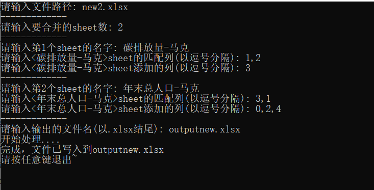
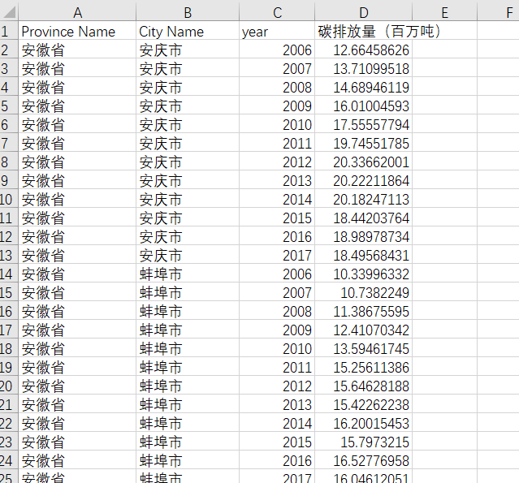
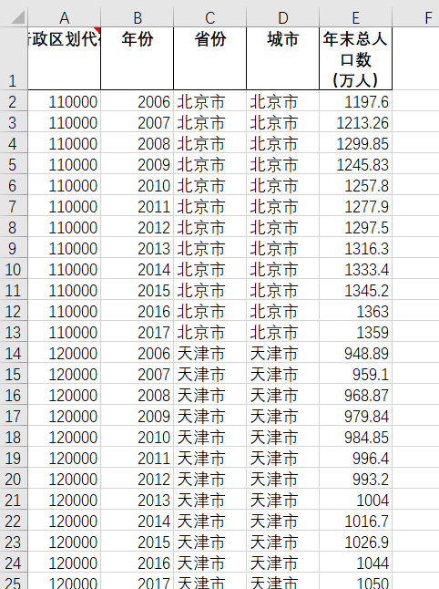
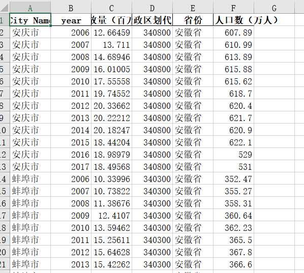

# 使用说明

该程序可以把一个表中的多个sheet合成一个sheet。通过匹配关键词判断是否是同一行。

# 使用步骤

1、输入文件的路径。

2、输入要合并的sheet信息

在<碳排放量-马克>sheet中 需要匹配的是B、C列 所以输入1,2（因为是从0开始）（注意逗号是英文逗号）

需要添加的列是D列所以输入3

在<年末总人口-马克>sheet需要匹配的是 D、B两列所以输入 3,1

需要添加的列是A、C、E所以输入0,2,4

3、输入输出文件路径

# 效果

